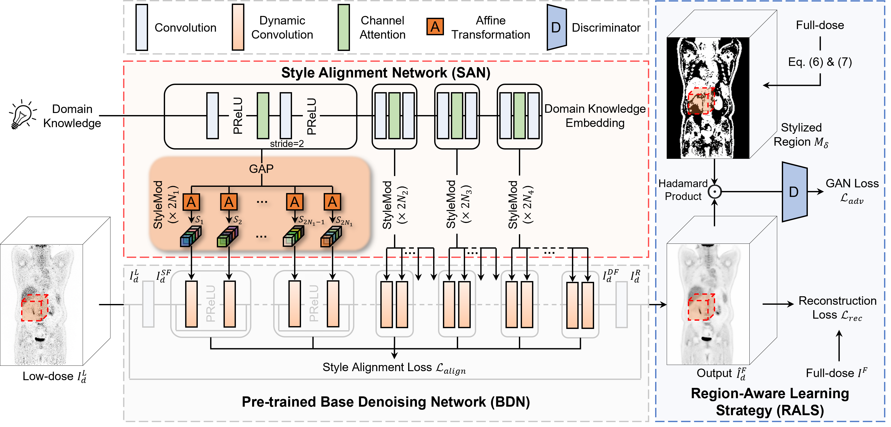
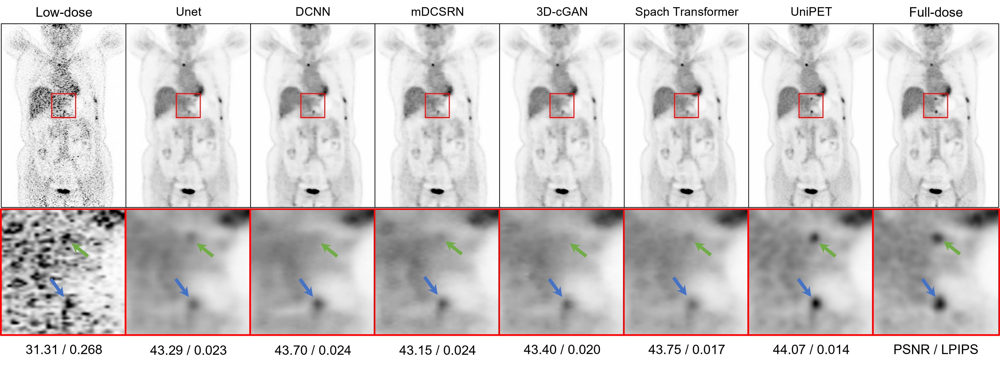

# UniPET: a universal network for high-quality PET image denoising across varied dose reduction factors
PyTorch re-implementation for 《[UniPET: a universal network for high-quality PET image denoising across varied dose reduction factors](https://www.sciencedirect.com/science/article/abs/pii/S1361841526001271)》[](https://arxiv.org/abs/2606.11131)

This project has undergone a lengthy peer-review process, including multiple rejections over the past four years. Consequently, the original codebase became difficult to maintain, and we therefore reimplemented it in the current version. This is the initial public release of the code, and we will provide updates if any issues are identified. At the very least, the model architecture has been faithfully reproduced.

## Framework




## Visualization



## Citation

If you find UniPET useful in your research, please consider citing:

```bibtex
@article{yang2026unipet,
  title={UniPET: a universal network for high-quality PET image denoising across varied dose reduction factors},
  author={Yang, Zhiwen and Zhou, Yang and Chen, Haowei and Zhang, Hui and Zhao, Dan and Wei, Bingzheng and Xu, Yan},
  journal={Medical Image Analysis},
  pages={104059},
  year={2026},
  publisher={Elsevier}
}
```


